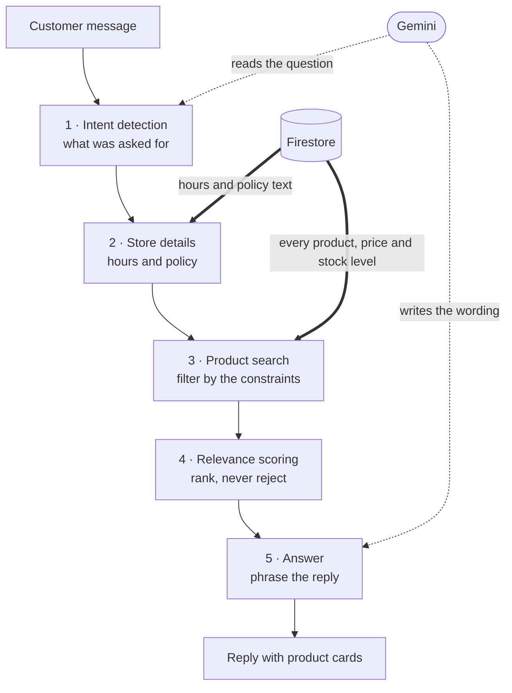

# FashionSync 👗

[](https://github.com/tasneembaqli04-jpg/fashion-sync-react/actions/workflows/ci.yml)

🔗 **Live site:** [fashionsync-dc79f.web.app](https://fashionsync-dc79f.web.app)

An information system for running an online fashion store: a customer interface for browsing and buying, and a management interface for inventory, orders, deliveries and settings.

Developed by Radyeh Moussa (212793954) and Tasnim Bakli (325488716).

For how to actually use the system, see [`USER_GUIDE.md`](./USER_GUIDE.md).

## Table of Contents

- [Purpose](#purpose)
- [Architecture](#architecture)
- [The AI Pipeline](#the-ai-pipeline)
- [Original Algorithms](#original-algorithms)
- [Technology Stack](#technology-stack)
- [Data Model](#data-model)
- [Project Structure](#project-structure)
- [Setup and Development](#setup-and-development)
- [Environment Variables](#environment-variables)
- [Testing and CI](#testing-and-ci)
- [Deployment](#deployment)
- [Security](#security)

## Purpose

Small fashion stores selling through social networks struggle to keep stock accurate, track orders, and give a consistent buying experience. FashionSync brings all of it into one system.

- Real-time inventory, including variants by colour and size
- One place for sales, delivery and customer service
- Automated customer email: order confirmation, delivery updates, stock alerts
- AI assistance grounded in the live catalogue, not in generic answers
- Management reporting from live data

## Architecture

```
                    ┌──────────────────┐
                    │    Customer /    │
                    │     Manager      │
                    │  (React Web App) │
                    └────────┬─────────┘
                             │
                    ┌────────▼─────────┐
                    │     Firebase     │
                    │ Auth / Firestore │
                    │    / Storage     │
                    └────────┬─────────┘
                             │
                    ┌────────▼─────────┐
                    │  Cloud Functions │
                    │   (Node.js 22)   │
                    └───────┬─┬────────┘
                            │ │
                 ┌──────────┘ └──────────┐
                 ▼                       ▼
          ┌─────────────┐         ┌─────────────┐
          │  Gemini AI  │         │    Gmail    │
          │ (Vertex AI) │         │   (SMTP)    │
          └─────────────┘         └─────────────┘
```

The React frontend talks directly to Firebase Auth and Firestore for most operations, and to Cloud Functions for anything needing server-side logic: sending email, calling the AI models, and generating images. There are 18 cloud functions.

## The AI Pipeline

**The model never invents catalogue data.** Asked "do you have this dress in M?", a language model will answer fluently whether or not it knows, and a wrong answer about stock costs a real sale. So the model is never the source of a fact about the shop: it reads what the customer meant, and phrases an answer built from data the system fetched itself. That is why the assistant is a five-stage pipeline rather than one model call.

| Stage | What happens | Where |
|---|---|---|
| 1. Intent detection | Message and history go to Gemini constrained by a JSON schema, returning category, gender, size, colour, price range, occasion, style, season | `chatIntentService.js` |
| 2. Live data | Business hours, policy and store details read from Firestore | `chatOrchestratorService.js` |
| 3. Product search | Catalogue filtered by the hard constraints. Out-of-stock products are excluded | `chatProductService.js` |
| 4. Relevance scoring | Occasion, style and season rank the results. Scoring only reorders — it never rejects, so a search cannot come back empty because of the occasion | `chatProductService.js` |
| 5. Answer | Real results injected into the prompt with an explicit instruction not to invent products, prices or availability. Reply is streamed | `chatOrchestratorService.js` |



Gemini touches only the two ends. Every fact on the way through comes from Firestore.

| Model | Used for |
|---|---|
| `gemini-3-flash-preview` | Intent detection, chat replies, outfit planning |
| `gemini-3.1-flash-image` | Outfit visualization |
| `gemini-2.5-flash-image` | Try-On on a customer photo |
| `virtual-try-on-001` | Vertex AI Virtual Try-On |

## Original Algorithms

Four algorithms are implemented in the system rather than taken from a library, each solving a problem specific to a bilingual fashion catalogue. All four are unit tested.

| Algorithm | What it does | Where |
|---|---|---|
| **Hebrew stem derivation** | Folds final letters and drops the construct-state ending, so a search for `שמלה` matches `שמלת ערב`. A four-character floor keeps short words from being ground down to noise | `toHebrewStem` |
| **Relevance scoring** | Scores a product against the request on occasion, style and season, weighted 3, 2 and 1. The score sets the order of the results and never removes one | `getProductRelevanceScore` |
| **Three-level sort** | Availability first, then relevance descending, then price ascending. A sold-out perfect match sorts below an available good one, because the customer cannot buy the first | `chatProductService` |
| **Translation dictionary** | 17 product terms and 20 colours the translation API gets wrong — transliterating, injecting unrelated text, or picking the wrong sense of a homonym. Consulted before the API, which is called only on a miss | `translationService` |

## Technology Stack

| Layer | Choice |
|---|---|
| Frontend | React 19, Vite 8, SCSS Modules |
| Barcode | `@zxing/library`, reading from the device camera |
| Backend | Firebase Cloud Functions, Node.js 22 |
| AI | Google Gemini, Vertex AI Virtual Try-On |
| Email | Nodemailer over Gmail SMTP, authenticated with an app password held in Secret Manager |
| Database | Cloud Firestore, real time |
| Auth | Firebase Authentication, email and password |
| Testing | Vitest |

The interface supports Hebrew and English with dynamic RTL/LTR switching, plus light and dark themes. Product cards are reachable by keyboard, and dialogs close with Escape.

## Data Model

Firestore holds 15 collections. The four central ones:

| Collection | Document key | Main fields |
|---|---|---|
| `products` | product code (`FS-001`) | `name`, `nameEn`, `cat`, `gender`, `season`, `price`, `cost`, `stock`, `variants[]` |
| `orders` | auto-generated | `customerEmail`, `items[]`, `subtotal`, `discountAmount`, `total`, `status`, `shipping`, `payMethod` |
| `customers` | email address | `name`, `nameEn`, `phone`, `street`, `city`, `loyaltyPoints` |
| `giftCards` | card code (`GC-…`, `RTN-…`) | `amount`, `balance`, `buyerEmail`, `status` |

The rest: `carts`, `wishlists`, `deliveries`, `coupons`, `couponUsage`, `returnRequests`, `stockNotifications`, `contactMessages`, `feedback`, `settings`, `emailVerifications`.

`customers`, `carts`, `wishlists` and `emailVerifications` are keyed by email so the security rules can check ownership against the auth token without a lookup. `variants[]` holds `{ colorName, colorNameEn, sizes }`, and `stock` is the sum across all variants.

## Project Structure

7 customer panels and 14 management screens, built from 58 React components over 15 Firestore collections and 18 cloud functions.

```
fashion-sync-react/
├── .github/workflows/        # CI — runs tests and build on push and pull request
├── frontend/                 # React application
│   └── src/
│       ├── components/       # UI (customer/, manager/, checkout/, home/, common/)
│       ├── pages/            # Customer, Manager, Checkout, Home
│       ├── services/         # Direct Firestore access — the "database" layer
│       ├── functions/        # Business logic built on services/ — the "logic" layer
│       ├── hooks/            # Shared React hooks, and the page feature hooks
│       ├── translations/     # Hebrew/English strings
│       └── styles/           # SCSS Modules
├── backend/                  # Firebase Cloud Functions
│   └── src/
│       ├── config/           # Firebase Admin, Gemini, Vertex AI
│       ├── controllers/      # HTTP entry points — chat/, email/, tryOn/
│       └── services/         # Server logic, split the same three ways
└── scripts/                  # One-off maintenance scripts, outside the Vite build
```

`services/` performs database access and `functions/` holds the business logic built on it. Keeping the logic layer free of network calls is what makes it unit-testable, and every test file targets one of the two. Each self-contained feature of the customer and management pages lives in its own hook under `hooks/`. The backend mirrors the split, with each controller a thin entry point onto the matching service.

## Setup and Development

Requires Node.js 22+, npm, and the Firebase CLI (`npm install -g firebase-tools`). Java 11+ is needed only to run the emulator.

```bash
cd frontend && npm install && npm run dev
cd backend  && npm install
```

### Against the local emulator

```bash
firebase emulators:start --only functions   # first terminal
cd frontend && npm run dev:emulator         # second terminal
```

`dev:emulator` runs Vite with `--mode emulator`, loading `.env.emulator` over `.env`. Plain `npm run dev` still targets the cloud, and `npm run build` is unaffected.

If the emulator is not running, the calls fail and the chat falls back to a local reply engine — the answers look reasonable but do not come from the server.

## Environment Variables

Three files in `frontend/`, holding the same 17 variable names:

| File | Tracked | Loaded when | Contents |
|---|---|---|---|
| `.env` | No — gitignored | Always | Cloud function URLs (`cloudfunctions.net`) |
| `.env.emulator` | Yes | Only with `npm run dev:emulator` | The same variables pointing at `127.0.0.1:5001` |
| `.env.example` | Yes | Never | The variable names with placeholder values, to copy into `.env` |

`.env.emulator` is in the repository because it holds nothing but localhost addresses, so a fresh clone can run against the emulator without rebuilding seventeen URLs by hand. `.env` holds the deployed URLs and stays out.

Vite loads `.env` first, then `.env.<mode>` on top, overriding matching names.

Never commit API keys for external services, credentials, or service account files. The Firebase Web key in `firebase.js` is public by design and is not a secret — data is protected by security rules, not by hiding the key.

## Testing and CI

594 unit tests over the business logic.

| Suite | Tests | Covers |
|---|---|---|
| Frontend | 575 across 30 files | Pricing and rounding, the cancellation and return windows, stock and availability, revenue recognition, translation, date and month handling, which orders still need a decision |
| Backend | 19 across 1 file | The search logic: Hebrew stem derivation, relevance scoring, the three-level sort |

```bash
cd frontend && npm test        # frontend tests
cd frontend && npm run build   # build verification
cd backend  && npm test        # backend tests
```

`.github/workflows/ci.yml` runs these as two jobs, frontend and backend, on every push to `main` and on every pull request. Each installs with `npm ci` and runs its suite; the frontend job also verifies a production build. The backend has no build step, since the cloud functions are deployed from source. Neither job deploys.

## Deployment

Three parts, deployed separately:

```bash
cd backend && npx firebase-tools deploy --only functions
cd frontend && npm run build && cd .. && firebase deploy --only hosting
firebase deploy --only firestore:rules
```

A change to `firestore.rules` has no effect until the third command runs. Test new rules in the Rules Playground in the Firebase console first.

## Security

Firestore Security Rules control access by role. Credentials live in Secret Manager, never in the repository.

| Role | Access | Session |
|---|---|---|
| **Manager** | The only role that can edit products, settings and coupons. Identified by an exact email address on an authenticated account | `browserSessionPersistence` — ends with the tab, so the password is required again next visit |
| **Customer** | Reads and writes only data she owns, matched by email rather than by being signed in at all | `browserLocalPersistence` — survives a browser restart |
| **Guest** | Catalogue and store information only | None |

The rules also limit which fields each role may write — a customer can update an order's cancellation fields but not its total or status — and separate reading one document from scanning a collection, so a customer can validate her own gift card without enumerating every card.
