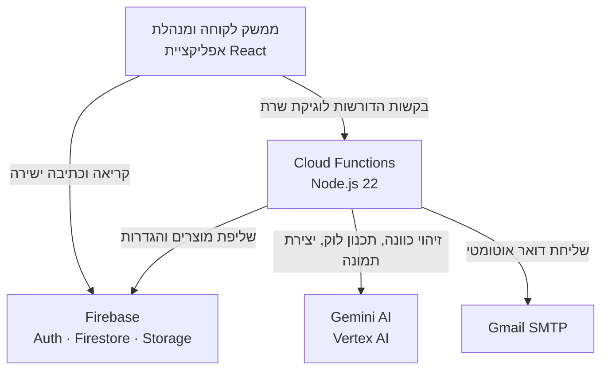
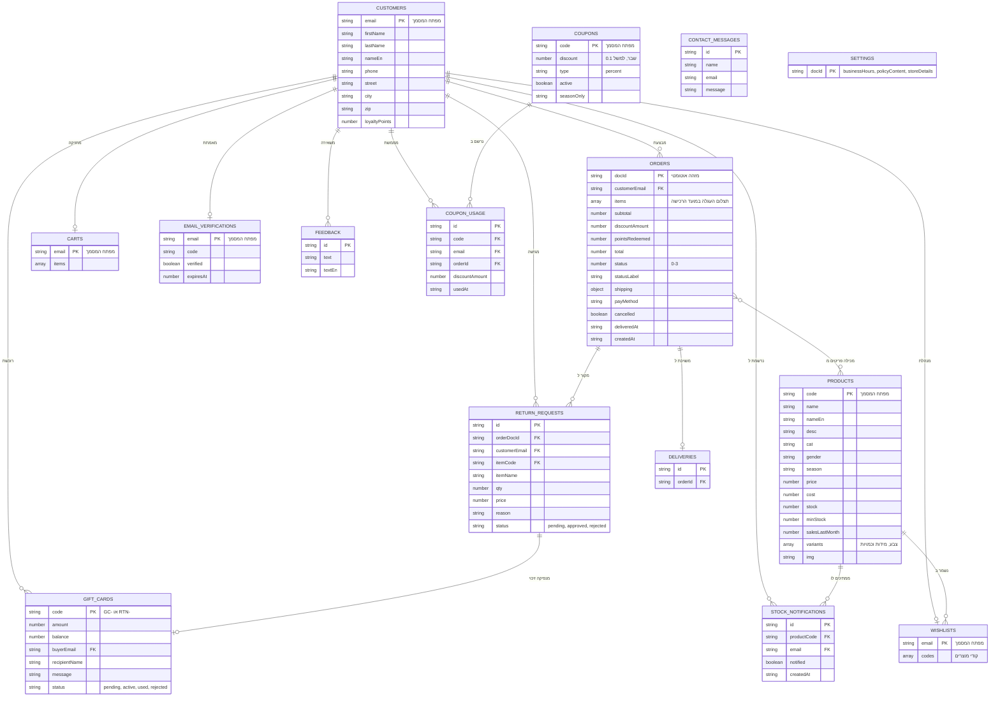

# מסמך אפיון — FashionSync

**צוות הפיתוח:** ראדיה מוסא (212793954) · תסנים בקלי (325488716)

## תוכן עניינים

- [0. מבוא](#0-מבוא)
- [1. דרישות משתמש](#1-דרישות-משתמש)
- [2. מקרי שימוש](#2-מקרי-שימוש)
- [3. תרשים זרימה — תהליך הזמנה](#3-תרשים-זרימה--תהליך-הזמנה)
- [4. מודל הנתונים](#4-מודל-הנתונים)

---

## 0. מבוא

### 0.1 מטרת המסמך

מסמך זה מגדיר את דרישות המערכת, את מקרי השימוש המרכזיים, ואת מודל הנתונים של FashionSync. הוא נועד לשמש בסיס להערכת הפרויקט ולתחזוקתו, ועומד בפני עצמו — אין צורך לקרוא מסמכים נוספים כדי להבין ממנו מה המערכת עושה וכיצד היא בנויה.

**המסמך מתאר את המערכת כפי שמומשה בפועל, ולא כפי שתוכננה.** דרישה שמומשה באופן חלקי מסומנת במפורש בעמודת המצב, יחד עם הסבר מה חסר.

מסמכים משלימים: [`README.md`](./README.md) לתיעוד טכני והתקנה, ו-[`USER_GUIDE.md`](./USER_GUIDE.md) למדריך שימוש.

### 0.2 תיאור המערכת

FashionSync היא מערכת מידע לניהול חנות אופנה מקוונת. היא כוללת שני ממשקים נפרדים: ממשק לקוחות לגלישה, רכישה ומעקב אחר הזמנות, וממשק ניהול למלאי, הזמנות, משלוחים, לקוחות והגדרות החנות.

הבעיה שהמערכת פותרת: חנויות אופנה קטנות המוכרות דרך רשתות חברתיות מתקשות לשמור על מלאי מדויק, לעקוב אחר הזמנות, ולספק חוויית רכישה עקבית. FashionSync מרכזת את התהליכים הללו במערכת אחת.

### 0.3 היקף המערכת

| מדד | כמות |
|---|---|
| פאנלים בממשק הלקוחה | 7 |
| מסכים בממשק הניהול | 14 |
| אוספי נתונים ב-Firestore | 15 |
| פונקציות ענן | 17 |
| קומפוננטות React | 57 |
| בדיקות יחידה אוטומטיות | 165 |

### 0.4 ארכיטקטורה



הפרונטאנד פונה ישירות ל-Firebase Auth ול-Firestore ברוב הפעולות. פנייה ל-Cloud Functions נעשית רק כאשר נדרשת לוגיקת שרת: שליחת דואר, פנייה למודלי הבינה המלאכותית, ויצירת תמונות. הרשאות הגישה לנתונים נאכפות בחוקי האבטחה של Firestore.

---

## 1. דרישות משתמש

### 1.1 דרישות פונקציונליות — לקוחה

| # | דרישה | מצב |
|---|---|---|
| FR-C-01 | המערכת תאפשר ללקוחה להירשם ולהתחבר באמצעות כתובת דוא"ל וסיסמה | מומש |
| FR-C-02 | המערכת תאפשר גלישה כאורחת בקטלוג, ללא אפשרות הוספה לעגלה או ביצוע הזמנה | מומש |
| FR-C-03 | המערכת תאפשר ללקוחה לחפש מוצר לפי שם או לפי קוד מוצר | מומש |
| FR-C-04 | המערכת תאפשר סינון הקטלוג לפי מגדר, קטגוריה, עונה וטווח מחירים | מומש |
| FR-C-05 | המערכת תאפשר ללקוחה לשמור מוצרים לרשימת משאלות אישית | מומש |
| FR-C-06 | המערכת תאפשר ללקוחה להוסיף מוצר לעגלה תוך בחירת צבע ומידה | מומש |
| FR-C-07 | המערכת תמנע הוספת צירוף צבע-מידה שאזל מהמלאי | מומש |
| FR-C-08 | המערכת תאפשר ללקוחה להירשם לקבלת התראה כאשר מוצר שאזל יחזור למלאי | מומש חלקית — הבקשה נשמרת והמנהלת שולחת את ההתראה ידנית ממסך הניהול |
| FR-C-09 | המערכת תאפשר ללקוחה לבחור שיטת משלוח מבין ארבע: רגיל, מהיר, אותו יום, איסוף עצמי | מומש |
| FR-C-10 | המערכת תעניק משלוח רגיל ללא עלות בהזמנה שסכומה ₪200 ומעלה | מומש |
| FR-C-11 | המערכת תאפשר ללקוחה להזין קוד קופון ולקבל הנחה באחוזים | מומש חלקית — אין אכיפת הגבלת שימוש; ניתן לממש קופון יותר מפעם אחת |
| FR-C-12 | המערכת תצבור ללקוחה נקודת נאמנות אחת עבור כל ₪1 בהזמנה | מומש |
| FR-C-13 | המערכת תאפשר ללקוחה לממש נקודות נאמנות כהנחה בתשלום | מומש חלקית — הסכום הנפדה נקרא מאחסון הדפדפן ואינו מאומת מול היתרה בשרת |
| FR-C-14 | המערכת תאפשר ללקוחה לרכוש כרטיס מתנה ולשלוח אותו לנמען | מומש |
| FR-C-15 | המערכת תאפשר ללקוחה לשלם באמצעות כרטיס מתנה או זיכוי החזרה | מומש |
| FR-C-16 | המערכת תשלח ללקוחה דוא"ל אישור עם השלמת ההזמנה | מומש |
| FR-C-17 | המערכת תאפשר ללקוחה לעקוב אחר סטטוס ההזמנה לאורך ארבעה שלבים | מומש |
| FR-C-18 | המערכת תאפשר ללקוחה לבטל הזמנה עצמאית תוך 24 שעות ולפני שנשלחה | מומש |
| FR-C-19 | המערכת תחזיר למלאי את פריטי ההזמנה עם ביטולה | מומש |
| FR-C-20 | המערכת תאפשר ללקוחה להגיש בקשת החזרה תוך 7 ימים ממועד המסירה | מומש |
| FR-C-21 | המערכת תאפשר ללקוחה לתאם תאריך ושעת איסוף עצמי | מומש |
| FR-C-22 | המערכת תאפשר ללקוחה לפנות לחנות באמצעות טופס יצירת קשר | מומש |
| FR-C-23 | המערכת תאפשר ללקוחה לשוחח עם עוזר חכם בנושאי מוצרים, מחירים, מבצעים ומדיניות | מומש |
| FR-C-24 | המערכת תציג ללקוחה המלצת לוק מלא בליווי הדמיה חזותית | מומש |
| FR-C-25 | המערכת תאפשר ללקוחה להעלות תמונה שלה ולראות מוצר נבחר עליה | מומש |

### 1.2 דרישות פונקציונליות — מנהלת

| # | דרישה | מצב |
|---|---|---|
| FR-M-01 | המערכת תאפשר למנהלת להתחבר לממשק ניהול נפרד באמצעות חשבון מאומת | מומש |
| FR-M-02 | המערכת תאפשר למנהלת להוסיף, לערוך ולמחוק מוצרים | מומש |
| FR-M-03 | המערכת תאפשר ניהול וריאנטים של מוצר לפי צבע ומידה, עם כמות נפרדת לכל צירוף | מומש |
| FR-M-04 | המערכת תתרגם אוטומטית שם ותיאור מוצר לאנגלית בעת השמירה | מומש |
| FR-M-05 | המערכת תאפשר סריקת ברקוד ממצלמת המכשיר למילוי קוד מוצר | מומש |
| FR-M-06 | המערכת תציג למנהלת את כל ההזמנות, עם חיפוש לפי מספר הזמנה או טלפון | מומש |
| FR-M-07 | המערכת תסמן אוטומטית הזמנות שחרגו מזמן המשלוח המובטח | מומש |
| FR-M-08 | המערכת תאפשר למנהלת לאשר או לדחות הזמנה | מומש |
| FR-M-09 | המערכת תאפשר למנהלת לקדם את סטטוס ההזמנה לאורך שלבי המשלוח | מומש |
| FR-M-10 | המערכת תשלח ללקוחה דוא"ל עדכון בעת שינוי סטטוס משלוח | מומש |
| FR-M-11 | המערכת תאפשר למנהלת לאשר או לדחות בקשת החזרה | מומש |
| FR-M-12 | המערכת תנפיק זיכוי אוטומטי ככרטיס מתנה עם אישור בקשת החזרה | מומש |
| FR-M-13 | המערכת תאפשר למנהלת לאשר או לדחות הזמנת כרטיס מתנה | מומש |
| FR-M-14 | המערכת תציג למנהלת פניות יצירת קשר ומשוב לקוחות | מומש |
| FR-M-15 | המערכת תאפשר למנהלת ליצור ולנהל קודי הנחה | מומש |
| FR-M-16 | המערכת תאפשר למנהלת לערוך את תוכן המדיניות, שעות הפעילות ופרטי החנות | מומש |
| FR-M-17 | שינוי בהגדרות החנות ישתקף מיידית בתשובות העוזר החכם | מומש |
| FR-M-18 | המערכת תציג למנהלת דוחות מכירה ונתוני ביצועים מנתונים חיים | מומש |
| FR-M-19 | המערכת תציג למנהלת את רשימת הלקוחות הממתינים לחידוש מלאי | מומש |
| FR-M-20 | המערכת תציג למנהלת התראות מלאי נמוך לפי סף שהוגדר למוצר | מומש |

### 1.3 דרישות לא-פונקציונליות

| # | דרישה | מצב |
|---|---|---|
| NFR-01 | המערכת תתמוך בעברית ובאנגלית, כולל מעבר דינמי בין כיווני תצוגה RTL ו-LTR | מומש |
| NFR-02 | המערכת תשמור את בחירת השפה וערכת הנושא בין ביקורים | מומש |
| NFR-03 | המערכת תציע מצב תצוגה בהיר וכהה | מומש |
| NFR-04 | נתוני הקטלוג וההזמנות יתעדכנו בזמן אמת ללא רענון ידני | מומש |
| NFR-05 | הקטלוג יהיה נגיש לניווט מקלדת מלא | מומש חלקית — ניווט וסגירת דיאלוגים במקלדת קיימים; חסרים ניהול מיקוד בפתיחת חלונות והכרזות `aria-live` |
| NFR-06 | פריטי הזמנה יישמרו בשתי השפות במועד הרכישה, כדי שהזמנה תוצג נכון גם אם הקטלוג ישתנה | מומש |
| NFR-07 | הרשאות הגישה לנתונים ייאכפו בצד השרת ולא בצד הלקוח | מומש חלקית — חוקי Firestore אוכפים בעלות והרשאות; חישוב סכום ההזמנה עדיין מתבצע בדפדפן |
| NFR-08 | לקוחה תוכל לגשת אך ורק לנתונים שבבעלותה | מומש |
| NFR-09 | סיסמאות לא יאוחסנו בקוד המקור | מומש |
| NFR-10 | העוזר החכם יבסס את תשובותיו על נתוני הקטלוג בפועל ולא ייצר מידע שאינו קיים | מומש |
| NFR-11 | העוזר החכם לא ימליץ על מוצרים שאזלו מהמלאי | מומש |
| NFR-12 | הלוגיקה העסקית תהיה מכוסה בבדיקות יחידה אוטומטיות | מומש חלקית — 165 בדיקות על שכבת הלוגיקה; שכבת הגישה לנתונים אינה מכוסה |
| NFR-13 | המערכת תיפרס כאתר סטטי מול שירותי ענן מנוהלים | מומש |
| NFR-14 | מערך הבדיקות והבנייה יורצו אוטומטית בכל שינוי בקוד, ותוצאתם תוצג בממשק הניהול של המאגר | מומש — מוגדר ב-`.github/workflows/ci.yml`, ורץ על כל דחיפה לענף הראשי ועל כל בקשת משיכה |
| NFR-15 | זהות המשתמשת תיקבע על ידי שירות האימות בלבד; אחסון מקומי בדפדפן ישמש כמטמון תצוגה ולא כמקור סמכות | מומש — מאזין `onAuthStateChanged` מסנכרן את המטמון בכל שינוי במצב האימות ומנקה אותו כאשר אין משתמשת מחוברת |
| NFR-16 | משך חיי הסשן ייקבע במפורש לכל תפקיד: סשן הניהול יסתיים עם סגירת הדפדפן, וסשן הלקוחה ישרוד אותה | מומש — `browserSessionPersistence` בכניסת המנהלת ו-`browserLocalPersistence` בכניסת הלקוחה |

---

## 2. מקרי שימוש

### UC-01 — ביצוע הזמנה

| | |
|---|---|
| **שחקן** | לקוחה רשומה |
| **תנאי קדם** | הלקוחה מחוברת · בעגלה יש לפחות פריט אחד |
| **תוצאה** | נוצרה הזמנה, המלאי עודכן, ונשלח דוא"ל אישור |

**זרימה ראשית**

1. הלקוחה פותחת את העגלה ועוברת לתהליך התשלום
2. המערכת ממלאת אוטומטית את פרטי המשלוח מפרופיל הלקוחה
3. הלקוחה בוחרת שיטת משלוח
4. המערכת מחשבת עלות משלוח, ומאפסת אותה במשלוח רגיל מעל ₪200
5. הלקוחה מזינה קופון, מממשת נקודות או מזינה קוד כרטיס מתנה — כל אחד מהם אופציונלי
6. הלקוחה בוחרת אמצעי תשלום ומאשרת
7. המערכת יוצרת מסמך הזמנה, מנכה מלאי, מזכה נקודות ומנפיקה כרטיסי מתנה שנרכשו
8. המערכת שולחת דוא"ל אישור ומציגה מסך סיכום

**זרימות חלופיות**

| # | תנאי | התנהגות |
|---|---|---|
| A1 | העגלה ריקה בעת האישור | ההזמנה נעצרת עם הודעת שגיאה |
| A2 | ההזמנה מכילה כרטיסי מתנה בלבד | לא נגבית עלות משלוח ולא נצברות נקודות |
| A3 | ניכוי המלאי נכשל בפריט מסוים | הכשל נרשם ביומן והלולאה ממשיכה לשאר הפריטים |
| A4 | שליחת הדוא"ל נכשלת | ההזמנה נשמרת; הכשל נרשם ביומן ואינו נחשף למשתמשת |

---

### UC-02 — ביטול הזמנה

| | |
|---|---|
| **שחקן** | לקוחה רשומה |
| **תנאי קדם** | ההזמנה בבעלות הלקוחה · טרם עברו 24 שעות · ההזמנה טרם הגיעה לשלב "נמסרה" |
| **תוצאה** | ההזמנה סומנה כמבוטלת והפריטים הוחזרו למלאי |

**זרימה ראשית**

1. הלקוחה פותחת את מסך "ההזמנות שלי"
2. המערכת בודקת את חלון הביטול ומציגה את הכפתור רק אם הוא פתוח
3. הלקוחה לוחצת "ביטול" ומאשרת
4. המערכת מסמנת את ההזמנה `cancelled` ורושמת חותמת זמן
5. המערכת מחזירה את הפריטים למלאי
6. המערכת שולחת דוא"ל אישור ביטול

**זרימות חלופיות**

| # | תנאי | התנהגות |
|---|---|---|
| A1 | חלון 24 השעות חלף | הכפתור אינו מוצג |
| A2 | ההזמנה כבר במצב "נמסרה" | הכפתור אינו מוצג; ניתן להגיש בקשת החזרה במקום |
| A3 | ההזמנה כבר בוטלה | הכפתור אינו מוצג |

**הערה:** מסמך ההזמנה אינו נמחק. הוא נשמר עם סימון ביטול כדי להישאר בהיסטוריה ובדוחות.

---

### UC-03 — בקשת החזרה

| | |
|---|---|
| **שחקנים** | לקוחה רשומה · מנהלת |
| **תנאי קדם** | ההזמנה בסטטוס "נמסרה" · טרם עברו 7 ימים ממועד המסירה |
| **תוצאה** | נוצרה בקשת החזרה; באישור — הונפק זיכוי |

**זרימה ראשית**

1. הלקוחה פותחת את ההזמנה ובוחרת "בקשת החזרה"
2. הלקוחה בוחרת את הפריטים ומזינה סיבה
3. המערכת יוצרת בקשה בסטטוס `pending`
4. המנהלת רואה את הבקשה במסך ההחזרות
5. המנהלת מאשרת את הבקשה
6. המערכת מנפיקה כרטיס מתנה בקוד המתחיל ב-`RTN-` בסכום הפריטים
7. המערכת מחזירה את הפריטים למלאי ושולחת דוא"ל ללקוחה

**זרימות חלופיות**

| # | תנאי | התנהגות |
|---|---|---|
| A1 | חלון 7 הימים חלף | האפשרות אינה מוצגת |
| A2 | המנהלת דוחה את הבקשה | הסטטוס משתנה ל-`rejected`, לא מונפק זיכוי, ונשלח דוא"ל |

---

### UC-04 — ניהול מלאי

| | |
|---|---|
| **שחקן** | מנהלת |
| **תנאי קדם** | המנהלת מחוברת לממשק הניהול |
| **תוצאה** | הקטלוג עודכן ומשתקף מיידית בצד הלקוחה |

**זרימה ראשית**

1. המנהלת פותחת את מסך המלאי ובוחרת הוספה או עריכה
2. המנהלת מזינה קוד, שם, תיאור, קטגוריה, מגדר, עונה ומחיר
3. המנהלת מגדירה וריאנטים — לכל צבע, כמות נפרדת לכל מידה
4. המנהלת מעלה תמונת מוצר
5. עם השמירה, המערכת מתרגמת את השם והתיאור לאנגלית
6. המערכת שומרת את המוצר, והקטלוג מתעדכן בזמן אמת

**זרימות חלופיות**

| # | תנאי | התנהגות |
|---|---|---|
| A1 | המנהלת סורקת ברקוד | קוד המוצר מתמלא אוטומטית מהמצלמה |
| A2 | שירות התרגום אינו זמין | המוצר נשמר; שדה התרגום נשאר ריק וניתן להשלמה מאוחר יותר |
| A3 | סך המלאי יורד מתחת לסף המוצר | המוצר מופיע במסך התראות המלאי |

---

### UC-05 — שיחה עם העוזר החכם

| | |
|---|---|
| **שחקן** | לקוחה |
| **תנאי קדם** | — |
| **תוצאה** | הלקוחה קיבלה תשובה המבוססת על נתוני החנות בפועל |

**זרימה ראשית**

1. הלקוחה מקלידה שאלה בחלון הצ'אט
2. המערכת מזהה את כוונת הפנייה ומחלצת ממנה קטגוריה, מגדר, מידה, צבע, טווח מחיר, אירוע, סגנון ועונה
3. המערכת שולפת נתונים חיים — שעות פעילות, מדיניות ופרטי חנות
4. עבור פנייה בנושא מוצרים, המערכת מחפשת בקטלוג ומסננת מוצרים שאזלו
5. המערכת מדרגת את התוצאות לפי התאמה לאירוע, לסגנון ולעונה
6. המערכת מזריקה את התוצאות לפנייה למודל, עם הנחיה שלא לייצר מידע שאינו ברשימה
7. התשובה מוצגת בזרימה, ומתחתיה כרטיסי המוצרים שנמצאו

**זרימות חלופיות**

| # | תנאי | התנהגות |
|---|---|---|
| A1 | הפנייה אינה בהירה דיה | המערכת מציגה שאלת הבהרה אחת ועוצרת |
| A2 | לא נמצאו מוצרים תואמים | המערכת מודיעה על כך ומציעה לשנות צבע, מידה, קטגוריה או תקציב |
| A3 | הפנייה עוסקת בשעות פעילות או במדיניות | התשובה מבוססת על מסמכי ההגדרות בלבד |
| A4 | שירות ה-AI אינו זמין | הדפדפן עובר למנוע תשובות מקומי מצומצם |

---

### UC-06 — המלצת לוק והדמיה חזותית

| | |
|---|---|
| **שחקן** | לקוחה |
| **תנאי קדם** | הפנייה מבקשת לוק מלא |
| **תוצאה** | הוצגה תמונת לוק שהורכב ממוצרים קיימים בקטלוג |

**זרימה ראשית**

1. הלקוחה מבקשת לוק לאירוע
2. המערכת מזהה שמדובר בבקשה ללוק מלא
3. המערכת מחפשת מוצרים מתאימים ומעבירה אותם למתכנן הלוקים
4. המתכנן בוחר שילוב פריטים מתוך המוצרים שנמצאו
5. המערכת מייצרת תמונה של הלוק על דמות שנוצרת בבינה מלאכותית
6. התמונה מוצגת יחד עם רשימת הפריטים

**זרימות חלופיות**

| # | תנאי | התנהגות |
|---|---|---|
| A1 | המגדר אינו ידוע | המערכת שואלת אם הלוק מיועד לאישה או לגבר לפני שהיא ממשיכה |
| A2 | לא נמצאו מוצרים מתאימים | המערכת מודיעה שאין ממה להרכיב לוק |
| A3 | יצירת התמונה נכשלת | המערכת מציגה הודעה מתאימה במקום שגיאה |
| A4 | הלקוחה מבקשת להחליף פריט אחד | רק אותו פריט מוחלף; שאר הלוק נשמר |

---

### UC-07 — הדמיית לבישה על תמונת הלקוחה

| | |
|---|---|
| **שחקן** | לקוחה |
| **תנאי קדם** | נבחר מוצר מהקטלוג |
| **תוצאה** | הוצגה תמונה של המוצר על הלקוחה |

**זרימה ראשית**

1. הלקוחה פותחת מוצר ובוחרת באפשרות ההדמיה
2. הלקוחה מעלה תמונה שלה
3. המערכת שולחת את תמונת הלקוחה ואת תמונת המוצר לשירות ההדמיה
4. התמונה שנוצרה מוצגת ללקוחה

**זרימות חלופיות**

| # | תנאי | התנהגות |
|---|---|---|
| A1 | לא הועלתה תמונה | ההפעלה נחסמת עם הודעה |
| A2 | פורמט או גודל התמונה אינם נתמכים | המערכת ממירה את תמונת המוצר במידת הצורך, או מציגה שגיאה |
| A3 | שירות ההדמיה נכשל | מוצגת הודעת שגיאה; לא נשמר דבר |

**הערה:** תהליך זה נבדל מ-UC-06 — כאן נעשה שימוש בתמונת הלקוחה עצמה, ולא בדמות שנוצרת בבינה מלאכותית.

---

### UC-08 — טיפול בהזמנה

| | |
|---|---|
| **שחקן** | מנהלת |
| **תנאי קדם** | קיימת הזמנה חדשה |
| **תוצאה** | ההזמנה קודמה בתהליך והלקוחה עודכנה |

**זרימה ראשית**

1. המנהלת פותחת את מסך ההזמנות
2. המערכת מסמנת הזמנות שחרגו מזמן המשלוח המובטח
3. המנהלת בוחרת הזמנה ובודקת את פרטי הלקוחה והפריטים
4. המנהלת מאשרת את ההזמנה
5. המנהלת מקדמת את הסטטוס לאורך השלבים
6. המערכת שולחת דוא"ל עדכון בכל שינוי סטטוס
7. בהגעה לשלב הסופי, המערכת רושמת את מועד המסירה ופותחת את חלון ההחזרה

**זרימות חלופיות**

| # | תנאי | התנהגות |
|---|---|---|
| A1 | המנהלת דוחה את ההזמנה | ההזמנה מסומנת כנדחית ונשלח דוא"ל ללקוחה |
| A2 | ההזמנה היא לאיסוף עצמי | תוויות השלבים משתנות בהתאם, והלקוחה מתאמת מועד איסוף |

---

## 3. תרשים זרימה — תהליך הזמנה

```mermaid
flowchart TD
    A[הלקוחה מוסיפה מוצר לעגלה] --> B{מחוברת?}
    B -->|לא| C[הפניה להרשמה או התחברות]
    C --> B
    B -->|כן| D{הצירוף צבע-מידה במלאי?}
    D -->|לא| E[חסימת ההוספה + הצעה להתראת חידוש מלאי]
    D -->|כן| F[הפריט נשמר בעגלה ב-Firestore]
    F --> G[מעבר לתהליך תשלום]

    G --> H[מילוי אוטומטי של פרטי משלוח מהפרופיל]
    H --> I[בחירת שיטת משלוח]
    I --> J{משלוח רגיל וסכום מעל 200?}
    J -->|כן| K[עלות משלוח = 0]
    J -->|לא| L[עלות משלוח לפי המחירון]
    K --> M[הנחות אופציונליות]
    L --> M

    M --> N[קופון / נקודות נאמנות / כרטיס מתנה]
    N --> O[חישוב סכום סופי]
    O --> P[בחירת אמצעי תשלום ואישור]

    P --> Q[יצירת מסמך ההזמנה]
    Q --> R[שמירת פרופיל הלקוחה]
    R --> S{ההזמנה כוללת מוצרים רגילים?}
    S -->|כן| T[צבירת נקודות נאמנות]
    S -->|לא| U[דילוג על צבירת נקודות]
    T --> V[ניכוי מלאי לכל פריט]
    U --> V

    V --> W{קיים כשל בפריט?}
    W -->|כן| X[רישום ביומן והמשך לפריט הבא]
    W -->|לא| Y[המשך]
    X --> Y

    Y --> Z{נרכשו כרטיסי מתנה?}
    Z -->|כן| AA[הנפקת כרטיס בסטטוס ממתין לאישור]
    Z -->|לא| AB[המשך]
    AA --> AC[מימוש קופון ונקודות]
    AB --> AC

    AC --> AD[שליחת דוא&#34;ל אישור]
    AD --> AE[ניקוי העגלה]
    AE --> AF[מסך סיכום ההזמנה]
```



**הערה על השלב האחרון:** רצף השלבים מ-Q עד AE אינו עטוף בטרנזקציה. כשל בשלב מסוים אינו מבטל את השלבים שקדמו לו. מגבלה זו מתועדת ב-README תחת פערים ידועים, והפתרון המתוכנן הוא ריכוז הרצף בפונקציית ענן אחת.

---

## 4. מודל הנתונים

המערכת מאחסנת את נתוניה ב-Cloud Firestore, בחמישה־עשר אוספים.



### 4.1 מפתח המסמך כמנגנון הרשאות

בארבעה אוספים — `customers`, `carts`, `wishlists` ו-`emailVerifications` — כתובת הדוא"ל של הלקוחה משמשת כמפתח המסמך במקום מזהה אוטומטי. זו בחירה מכוונת שמאפשרת לאכוף בעלות בתוך חוקי האבטחה עצמם:

```
function isOwner(email) {
  return isSignedIn() && request.auth.token.email.lower() == email.lower();
}
```

החוק משווה את מפתח המסמך לכתובת הדוא"ל שבטוקן ההזדהות. מכיוון שהמפתח **הוא** הכתובת, לקוחה יכולה להגיע אך ורק למסמך שלה — ללא צורך בקריאת שדה נוסף מתוך המסמך.

באוסף `orders` לא ניתן להשתמש בדפוס זה, שכן ללקוחה אחת הזמנות רבות. שם החוק משווה שדה `customerEmail`, והשאילתה בצד הלקוחה מסננת לפי אותו שדה — אחרת היא נדחית כולה.

### 4.2 הערות מבניות

- **`variants`** במוצר הוא מערך של `{ colorName, colorNameEn, sizes }`, כאשר `sizes` ממפה תווית מידה לכמות. סך המלאי הוא סכום הכמויות בכל הווריאנטים.
- **`items`** בהזמנה הוא תצלום של העגלה במועד הרכישה, כולל השם והצבע בשתי השפות. כך הזמנה מוצגת נכון גם לאחר שינוי בקטלוג.
- **`giftCards`** משמש בשני תפקידים: כרטיס שנרכש (קוד `GC-`) וזיכוי החזרה (קוד `RTN-`).
- **`deliveries`** אינו בשימוש בגרסה הנוכחית. מסך המשלוחים נגזר מאוסף `orders`. האוסף נשמר לצורך הרחבה עתידית.

### 4.3 מגבלה ידועה — פיזור המלאי בהחזרה

פריט הזמנה שומר את הצבע והמידה שנבחרו, אך לא את הפירוט לפי מידות כאשר הכמות נמשכה מכמה מידות.

כאשר פריט נקנה **ללא מידה מצוינת**, ניכוי המלאי מתפזר על פני המידות של אותו צבע לפי הסדר, עד להשלמת הכמות. בביטול הזמנה או באישור החזרה, הכמות כולה מוחזרת ל**מידה הראשונה** בלבד.

התוצאה: **סך המלאי של המוצר נשמר נכון, אך החלוקה בין המידות משתבשת.** דוגמה — מוצר עם `S:2, M:2, L:2`, קנייה של 5 יחידות ללא מידה, ולאחריה ביטול:

| שלב | S | M | L | סה"כ |
|---|---|---|---|---|
| התחלה | 2 | 2 | 2 | 6 |
| אחרי קנייה | 0 | 0 | 1 | 1 |
| אחרי ביטול | 5 | 0 | 1 | 6 |

המגבלה אינה מתרחשת ברכישה רגילה מהקטלוג, שבה המידה תמיד נבחרת. הפתרון המתוכנן הוא לשמור על פריט ההזמנה את החלוקה לפי מידות בעת הניכוי, כדי שההחזרה תוכל להפוך אותה במדויק.
